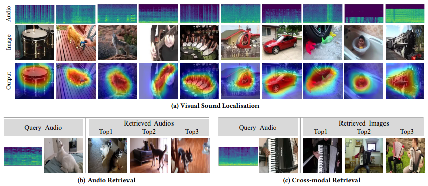

# Exploiting Transformation Invariance and Equivariance for Self-supervised Sound Localisation

The Official PyTorch code for ACMMM'22 paper `Exploiting Transformation Invariance and Equivariance for Self-supervised Sound Localisation`.

- Paper: [https://arxiv.org/abs/2206.12772v2](https://arxiv.org/abs/2206.12772v2) 
- Project Page: [https://jinxiang-liu.github.io/SSL-TIE/](https://jinxiang-liu.github.io/SSL-TIE/)



**Abstract**: We present a simple yet effective self-supervised framework for audio-visual representation learning, to localize the sound source in videos. To understand what enables to learn useful representations, we systematically investigate the effects of data augmentations, and reveal that (1) composition of data augmentations plays a critical role, i.e. explicitly encouraging the audio-visual representations to be invariant to various transformations (transformation invariance); (2) enforcing geometric consistency substantially improves the quality of learned representations, i.e. the detected sound source should follow the same transformation applied on input video frames (transformation equivariance). Extensive experiments demonstrate that our model significantly outperforms previous methods on two sound localization benchmarks, namely, FlickrSoundNet and VGG-Sound. Additionally, we also evaluate audio retrieval and cross-modal retrieval tasks. In both cases, our selfsupervised models demonstrate superior retrieval performances, even competitive with the supervised approach in audio retrieval. This reveals the proposed framework learns strong multi-modal representations that are beneficial to sound localisation and generalization to further applications.

Keywords: self-supervised representation learning, sound sourcelocalisation, retrieval.

```txt
@inproceedings{liu2022exploiting,
  title={Exploiting Transformation Invariance and Equivariance for Self-supervised Sound Localisation},
  author={Liu, Jinxiang and Ju, Chen and Xie, Weidi and Zhang, Ya},
  booktitle={Proceedings of the 30th ACM International Conference on Multimedia},
  pages={3742--3753},
  year={2022}
}
```


*****************
## Environment
- Python==3.6.10
- PyTorch==1.7.1
- CUDA_VERSION==11.0

## Dependencies
```bash
pip install -r requirements.txt
```

## Data Preparation
### VGGSound dataset

- Test data structure
(We process the annotations to xml file for convenience, download with either of the links:[Google Drive](https://drive.google.com/drive/folders/1KZxXbPilvJNCPaUeAeZAsUKgZoj9R9qJ?usp=sharing), [Baidu Pan](https://pan.baidu.com/s/1tripjJWIK2Ed_zErCAU4pw) Extracting code:`bqip`)

```txt
├── VGGSound_test
│   ├── audio
│   │   ├── __2MwJ2uHu0_000004.wav
│   │   ├── ...
│   ├── frame
│   │   ├── __2MwJ2uHu0_000004.jpg
│   │   └── ...
│   ├── anno
│   │   ├── __2MwJ2uHu0_000004.xml
│   │   └── ...
└── 
```

- Training data structure
```txt
├── VGGSound
│   ├── total_video_frames
│   │   ├── __-8wVOYH3c_000140
│   │   │   ├── 001.jpg
│   │   │   ├── ...
│   │   │   ├── 125.jpg
│   │   │   ├── ...
│   │   ├── ...
│   ├── total_video_3s_audio
│   │   ├── __-8wVOYH3c_000140.wav
│   │   └── ...
└── 
```
### Flickr dataset 
Please refer to [Learning to Localize Sound Sources](https://github.com/ardasnck/learning_to_localize_sound_source).

## Evaluation

### Model weights
Please download the pretrained model weights through either of the links and put them in the `ckpts` folder.
- [Google Drive](https://drive.google.com/drive/folders/1KZxXbPilvJNCPaUeAeZAsUKgZoj9R9qJ?usp=sharing)
- [Baidu Pan](https://pan.baidu.com/s/1tripjJWIK2Ed_zErCAU4pw) Extracting code:`bqip`


### Scripts
- Training on VGGSound-144k, test on VGG-SS
```bash
bash scripts/test_VGGSound.sh
```
- Training on VGGSound-144k, test on Flickr
```bash
bash scripts/test_VGGSound_Flickr.sh
```

- Training on Flickr-144k, test on Flcikr
```bash
bash scripts/test_Flickr144k.sh
```

- Training on Flickr-10k, test on Flcikr
```bash
bash scripts/test_Flickr10k.sh
```


## Training
- Prepare the datasets as mentioned.
- Use the scripts to train and replace the `dir_of_**set` variable in the script with your dataset path.
```bash 
bash scripts/train_**.sh
```

## Retrieval splits
Download the retrieval splits with either of the links:
- [Google Drive](https://drive.google.com/drive/folders/1KZxXbPilvJNCPaUeAeZAsUKgZoj9R9qJ?usp=sharing)
- [Baidu Pan](https://pan.baidu.com/s/1tripjJWIK2Ed_zErCAU4pw) Extracting code:`bqip`

## Acknowledgement
We thank Honglie[@hche11](https://github.com/hche11) for providing some of the codes.

We also thank the authors for providing the datasets, please consider also citing the works.
  - VGGSound
    - [VGG-SOUND](https://www.robots.ox.ac.uk/~vgg/data/vggsound/)
    - [VGG-SS](https://www.robots.ox.ac.uk/~vgg/research/lvs/)
  - Flickr
    - [Learning to Localize Sound Source in Visual Scenes](https://github.com/ardasnck/learning_to_localize_sound_source)
    - [Yahoo dataset](https://webscope.sandbox.yahoo.com/catalog.php?datatype=i&did=67&guccounter=1) and [SoundNet](http://projects.csail.mit.edu/soundnet/)
